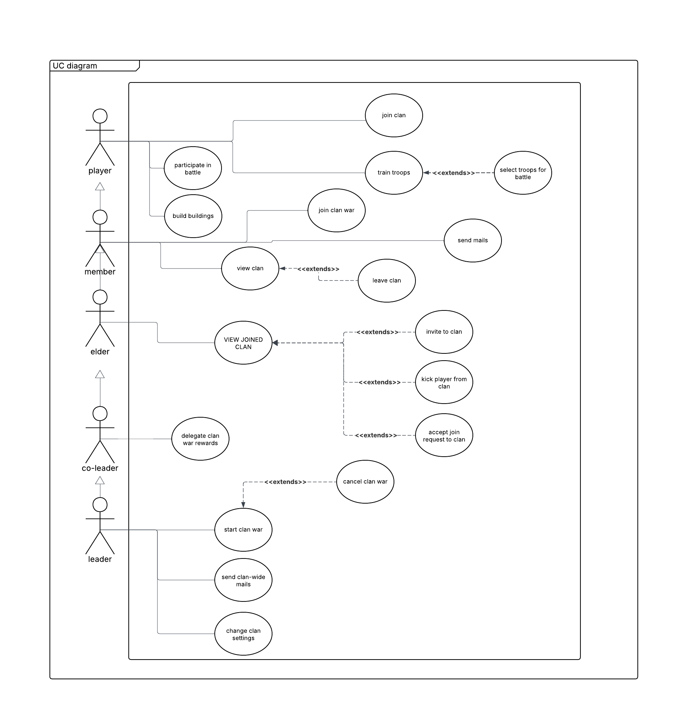
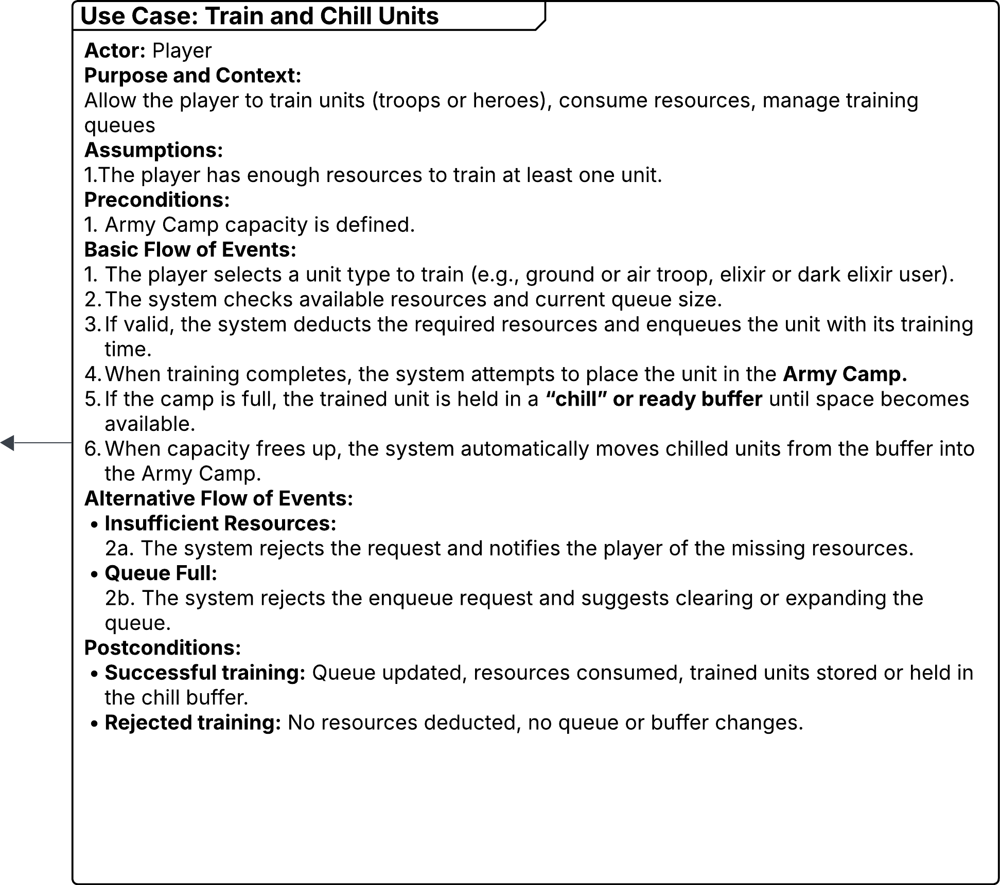
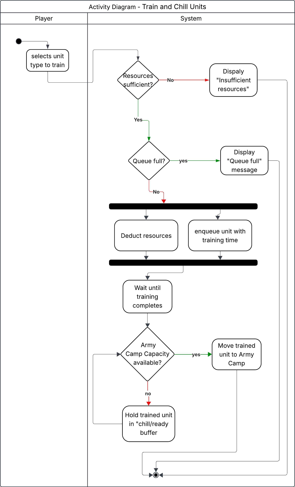
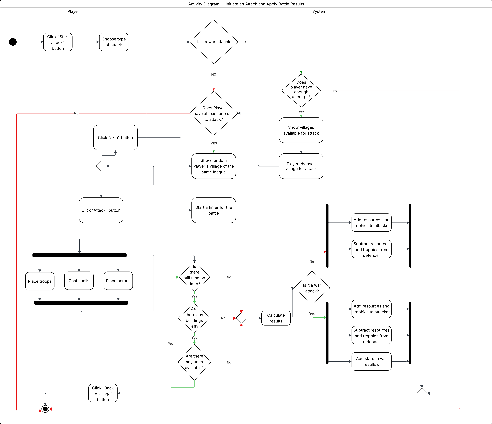
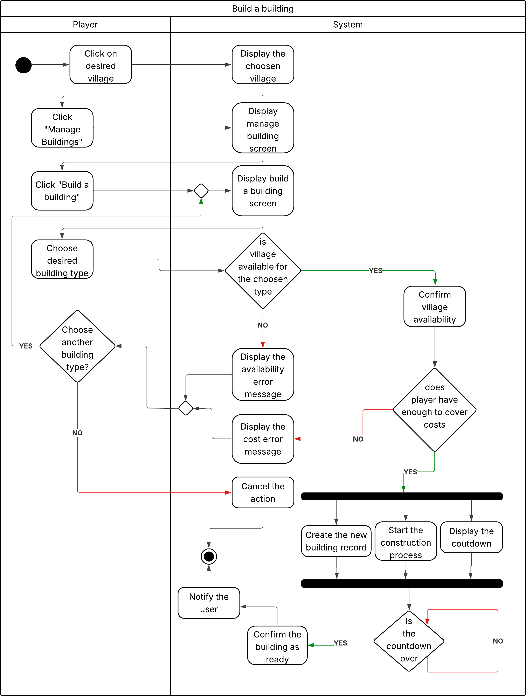
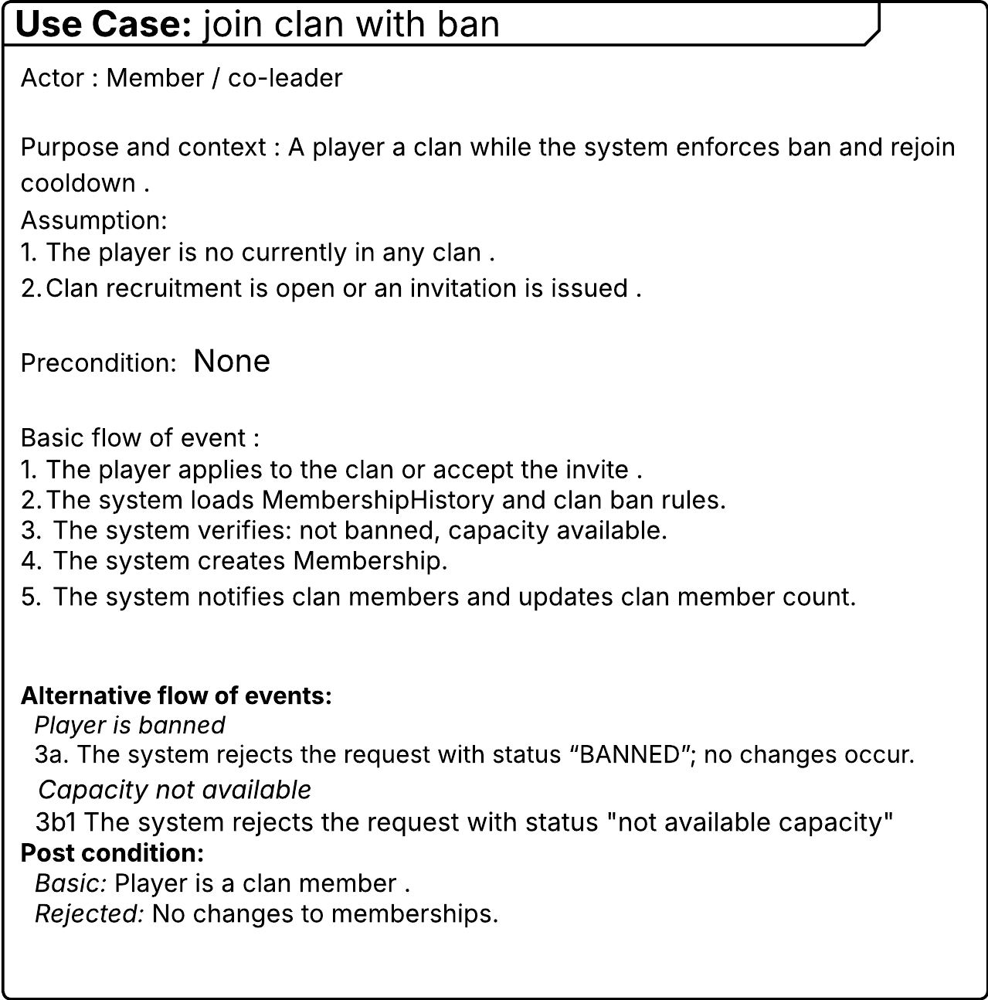
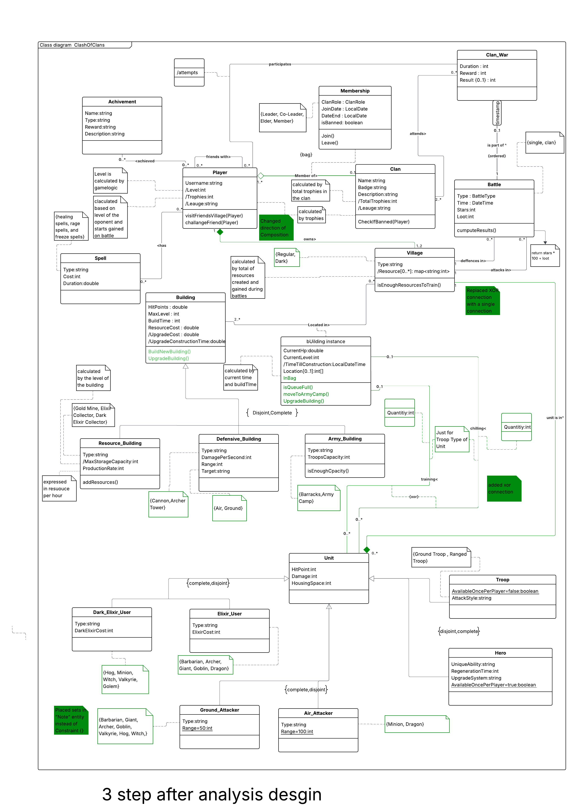

# Clash of Clans – Java Project #
---

S31371 Danylo Antypenko
S29991 Odul Lorelei Kafadar 
S29778 Konrad Markiewicz 
S30917 Danila Novik
---

User Requirements
 
The Clash of Clans system is designed to support both players and clan leaders in managing their villages, armies, clans, and battles. The system allows players to build and upgrade their villages, train troops, join clans, and participate in wars. Clan leaders and co-leaders are given special permissions to manage the clan, including recruitment, war strategies.
Each Player has a profile with basic information such as username, level, trophies, and league. Players can build and upgrade Buildings in their Village, train different types of Troops, create different spells, and engage in Battles against opponents. A player can belong to only one Clan at a time, while each clan can consist of multiple players. We want to store the information of the player's membership and past memberships to make sure that the clan will not admit the banned user.  
There can be two types of Villages (regular, dark) consists of multiple buildings, which are divided into subcategories: Resource Buildings (Gold Mine, Elixir Collector, Dark Elixir Collector), that have a production rate, type and maximum storage capacity. Defensive Buildings (Cannon, Archer Tower) have damage points per second, type , range and target (air, ground).  Army Buildings (Barracks, Army Camp) have their own troops capacity and type. Buildings can be upgraded to higher levels, with increasing costs and construction times. Each building has  hit points, build time, and resource cost. Buildings cannot exist independently of a village. 
All units are trained in the Barracks and rest in army camp.  Each unit troop has  certain attack style and by default not available once per player. Also, there can be only certain number of units in village and while they are in village have current hit points, current level, time till construction and location. Units are divided into categories: Elixir  (barbarians, Archers, Giants, Goblins, Dragons) and Dark Elixir  (Hog, Minion, Witch, Valkyrie, Golem). All units must belong to at least one type in each aspect. Also, units can be either air or ground attacker
Heroes (such as Barbarian King, Archer Queen, and Grand Warden) are special units that have unique abilities, regeneration times, upgrade systems, but unlike regular troops (which are also another type of unit), they can only exist once per player.
Spells represent another category of assets that can be created by Player. Each spell has effects (healing, rage, freeze), resource costs, and durations. Spells are optional assets for a player, but not all players have to use it.
Clans are central to the system. A clan has a name, badge, description, and a set of members. Each clan may participate in Clan Wars that have duration, reward and result (win or lose), which involve coordinated battles against another clan. When player joins to the clan, he receives a role (Leader, Co-Leader, Elder, Member) and join date.
The system tracks Battles between players, where a battle has attributes such as time, stars earned and  loot gained. A player may participate in multiple battles, and each battle links exactly two villages/players that one is attacking and the second is being attacked. Battles are ordered so that there is a sequence of attacks during a war, differentiated by timestamp. Battles also has two types single and clan type (clan war - each player has 2 attempts per war). You can earn trophies during a battle that will be calculated based on level of the opponent and starts gained on battle
Achievements are awarded to players when they reach specific milestones . Each achievement has a name, type, description and reward.
The system includes Friendship between players. A player can add another player as a friend, enabling friendly challenges and visits to their villages.

Analytical Class Diagram Description 

The main entity is the Player, who owns a Village/Villages (max 2) made up of different Buildings, including resource buildings (like gold mines), defensive buildings (such as cannons or archer towers), and army buildings (like barracks and army camps). Players can train Units, which include Troops and Heroes, each with attributes such as hit points, damage, and housing space. Troops may be ground or air attackers and use different resources like elixir or dark elixir.
It's worth showcasing that the Troop can either train or rest in the building.
Players can join Clans, forming social groups through the Membership relationship, which defines roles, levels, and join dates. We need to store information of the player’s membership to not add the player that is banned in a given clan. Clans compete in Clan Wars, earning rewards and trophies based on their performance. Players can also engage in Solo Battles with other villages to gain loot, trophies, and experience. The diagram includes Spells that influence battles and Achievements that track player progress and offer rewards.

.png)

Design Diagram Description 

The project is developed using  Java language with  an object-oriented programming approach that organizes the game world into clearly defined classes representing buildings, soldiers, resources, and game control mechanisms. The design diagram presents the structure of the system as it is defined for implementation in Java. Each class is shown with its attributes, including their specific Java data types and any enumeration values ​​used. It outlines elements such as players, clans, buildings, resources, soldiers, and units and how their information is represented at the code level. Combat and movement behavior is defined through structured logic that determines targeting, damage application, and positional updates. The algorithms controlling these actions ensure predictable and balanced results based on defined troop and building parameters. Object creation for troops and buildings is managed through organized constructors or factory-style methods, supporting scalability and adding new game elements with minimal structural changes.

The derived attriubiutes in programing approach will be implemented by: 
Player:
Level is calculated by gamelogic 
Trophies -claculated based on level of the oponent and starts gained on battle
Resource Building:
MaxStorage Capacity calculated by the level of the building
Clan 
Tocal Tophies calculated by trophies in the clan (added)
Clan and Player 
Laguea -calculated by trophies
Instance of the Building
Time Till constraction -calculated by current time and buildTIme
Village 
Resource calculated by total of resources created and gained during battles

Use Case Diagram 

----

   

Design Diagram after the analytic analysis - description 

The design diagram after Dynamic Analysis introduces a proper membership class for tracking clan participation over time, converts many stored fields (like trophies, levels, and total resources) into derived computational attributes, replaces simple war links with an Extends the calculation for. Several new features were added to buildings, battles, and units for location tracking, construction time, and timestamps, making the model more realistic and ready for implementation.

Newly introduced attributes:
ClanRole
JoinDate
DateEnd
isBanned
Location[0..1] (for building placement)
/TimeTillConstruction
QuantitiyMax
Modified attribute types:
Time → LocalDateTime
Most Date fields → LocalDateTime
Attributes changed to derived (/ prefix):
/Trophies
/Level
/League
/TotalTrophies
/MaxStorageCapacity (for buildings)

