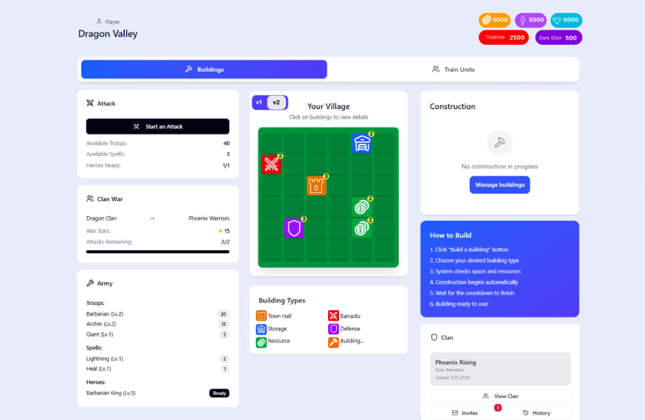
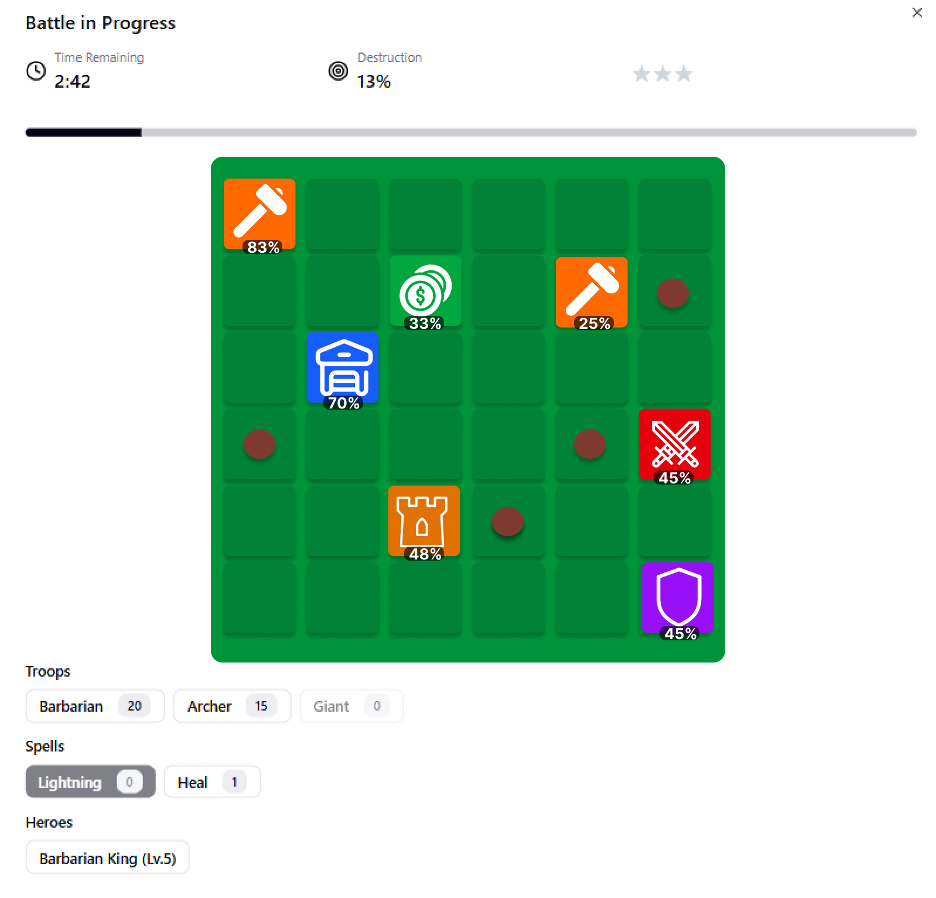
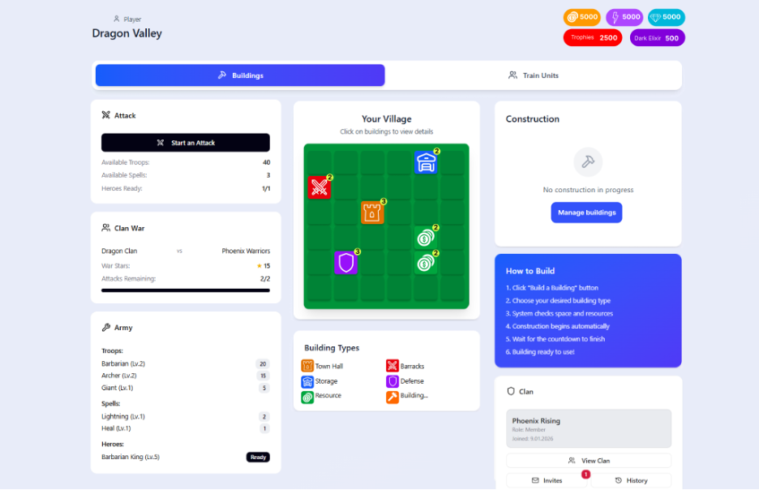

# Clash of Clans Management System

Object-oriented Java implementation of a Clash of Clans inspired management system featuring village building, troop training, clan systems, battles, persistence mechanisms, and UML-based software architecture.

---

## Features

- Building and upgrade system
- Troop and hero training
- Clan management
- Battle mechanics
- Save/load persistence
- GUI implementation
- UML-based architecture
- Dynamic analysis and design patterns

---

## Technologies Used

- Java
- JavaFX / Swing
- Serializable
- UML
- Git & GitHub

---

## System Architecture

```text
src/
 ├── models/
 ├── gui/
 ├── persistence/
 ├── services/
 ├── battles/
 ├── clans/
 └── main/
```

---

## Screenshots

### Main Village Menu



### Building System


### Battle System



### Clan Management



---

## UML & Documentation

Full project documentation including:

- User requirements
- UML diagrams
- Design decisions
- Activity diagrams
- State diagrams
- GUI discussion
- Full screenshots
- Dynamic analysis

[Open Full Documentation PDF](docs/CLASH_OF_CLANS_REPORT.pdf)

---

## Installation

```bash
git clone https://github.com/DanilAntyp/Clash_of_Clans
```

Open the project in IntelliJ IDEA or another Java IDE and run the main application.

---

## Authors

- Konrad Markiewicz
- Danylo Antypenko
- Odul Lorelei Kafadar
- Danila Novik
